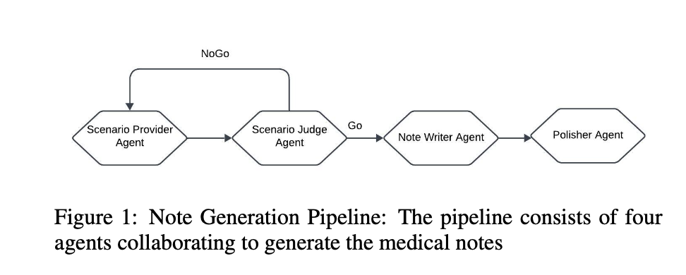

# MedSynth

Physicians spend significant time documenting clinical encounters, a burden that contributes to professional burnout. To address this, robust automation tools for medical documentation are crucial. We introduce MedSynth – a novel dataset of synthetic medical dialogues and notes designed to advance the Dialogue-to-Note (Dial-2-Note) and Note-to-Dialogue (Note-2-Dial) tasks. Informed by an extensive analysis of disease distributions, this dataset includes over 10,000 dialogue-note pairs covering over 2000 ICD-10 codes. We demonstrate that our dataset markedly enhances the perormance of models in generating medical notes from dialogues, and dialogues from medical notes. The dataset provides a valuable resource in a field
where open-access, privacy-compliant, and diverse training data are scarce. 

## Example Integration into a Medical Dialogue-to-Note Summarization Task

You can find an example of how to integrate MedSynth into a dialogue-to-note summarization pipeline in: `examples/dial2note_example.ipynb`. This example is configured to run on **Google Colab**.

## Reproducing Results and Generating Synthetic Data Using the Proposed Pipeline
The data generation pipeline can be brokendown into note-generation and dialogue generation pipelines.

The note-generation pipeline is presented in figure below:



### Environment Setup
You can set up the Conda environment using the `environment.yml` file.

### To Generate Synthetic Medical Notes and Dialogues
In our pipeline, notes need to be generated first, followed by the generation of dialogues based on those notes.
First, set your `OPENAI_API_KEY` as an environment variable.

#### To Generate Synthetic Medical Notes
You can use the code below to generte notes: 
```
# --output_dir: where to save the results
# --icd_csv_path: path to data/input/IQVIA/IQVIA_cleaned.csv
# --aci_train_path: path to data/input/TaskC-TrainingSet.csv
# --num_icd10: number of ICD10 codes to generate synthetic notes for
# --notes_per_icd10: number of synthetic notes per ICD10 code

python generate_notes.py \
  --output_dir "path" \ 
  --icd_csv_path "path"\ 
  --aci_train_path "path" \ 
  --num_icd10 50 \ 
  --notes_per_icd10 5 
  ```

Alternatively, you can use `slurm_generate_notes.sh` to generate notes. These will generate 5 notes per ICD-10 description by default, each saved as a separate `.csv` file in the specified directory.
If desired, you can change the number of notes per ICD-10 code by modifying `notes_count= 5`. 

#### To Generate Corresponding Synthetic Dialogues
You can use the follwing code: 
```
# --output_dir: where to save the results
# --aci_train_path: path to data/input/TaskC-TrainingSet.csv

python generate_dialogues.py \
  --path_to_input "path" \
  --aci_train_path "path"
```

Alternatively, you can use `slurm_generate_dialogue.sh`. These will generate corresponding dialogues for the notes in the directory.
You can combine the resulting `.csv` files into a single `.csv` using `data_gen/extract_data_pairs_from_dfs.py`.


### To Evaluate the Generated Dialogue–Note Pairs with Traditional Metrics
#### For Dialogue-to-Note Task
1. First, the generated data must be converted into the required format for instruction fine-tuning and uploaded to Hugging Face. To do so, go to `eval/dial2_note_create_process_datasets.py`, update the paths, and run the script. It will prepare the dataset for instruction fine-tuning with Llama 3 and push it to Hugging Face.

2. Go to `eval/run_tuning.py` aupdate the paths, and run it. This will fine-tune the model and upload the resulting checkpoint to Hugging Face. Alternatively, you can edit and use `eval/slurm_train_job_submit.sh`  to submit the tuning job to a slurm cluster. 

3. Go to `eval/run_eval.py` update the paths, and run the script. It will evaluate the fine-tuned model and return both model responses and automatic metrics. You can also submit the evaluation job to a SLURM cluster using `eval/slurm_eval_job_submit.sh`.

4. To repeat this process with the NoteChat dataset, first sample an equivalent number of datapoints using `eval/get_notechat_sample.py`. Then repeat steps 1 to 3 for tuning and evaluation.

#### For Note-to-Dialogue Task
1. First, the generated data must be converted into the required format for instrcution fine-tuning and be saved to huggingface. To do so, go to `eval/note2dial_create_process_datasets.py` and update the paths, then run it. It will create the dataset ready for instruction fine-tuning of Llama 3 and upload it to huggingface.

2. Go to `eval/run_tuning.py` and update the paths, then run it. It will tune the model and save the tuned model to huggingface. Alternatively, you can edit and use `eval/slurm_train_job_submit.sh`  to submit the tuning job to a slurm cluster. 

3. Go to `eval/run_eval.py` and edit the paths, then run it. It will evaluate the tuned model and return the model responses, as well as automatic metrics. Alternatively, you can submit the job to a slurm cluster using `eval/slurm_eval_job_note2dial.sh`.

4. To repeat the same process with NoteChat dataset, you need to first take a sample from it with the same size as your generated data using `eval/get_notechat_sample.py`. Then repeat steps 1 to 3 for tuning and evaluation.


### To Evaluate the Generated Dialogue–Note Pairs with the Jury
#### GPT-4o as the Judge
1. Go to `eval/get_promethus_relative_score_GPT.py`, and update the paths as needed. 

2. Depending on the task (dial-to-note or note-to-dial), uncomment the appropriate main function and run the script.

#### Prometheus as the Judge
1. Go to `eval/get_promethus_relative_score.py`, and update the paths. 

2. Depending on the task (dial-to-note or note-to-dial), uncomment the correct main function and run the script.

#### Qwen as the Judge
1. Go to `eval/get_qwen_relative_scores.py`, annd update the paths. 

2. Based on the task (dial-to-note or note-to-dial), uncomment the correct main function and run the script.


